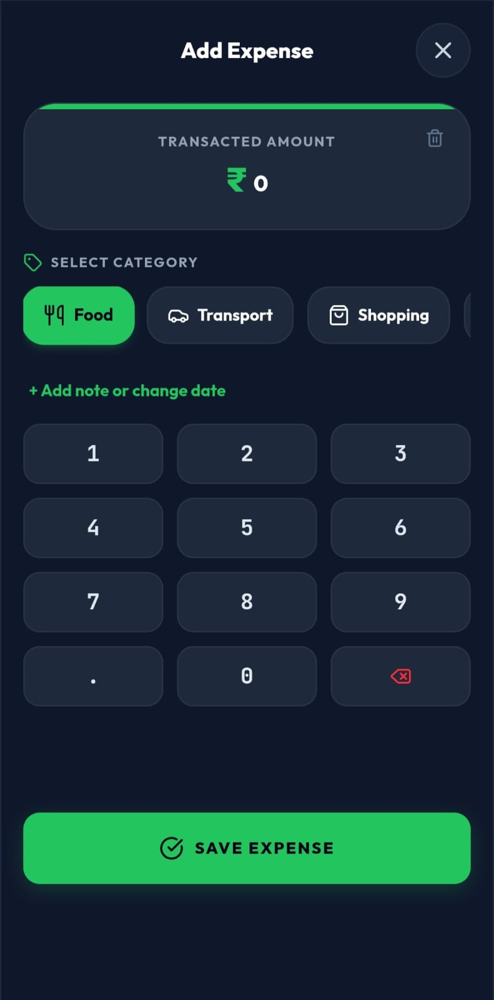
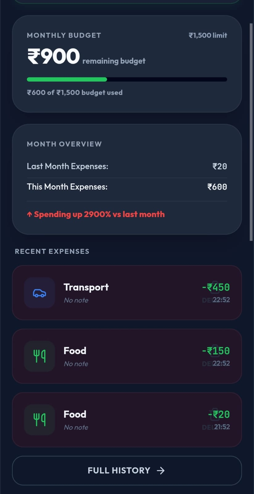
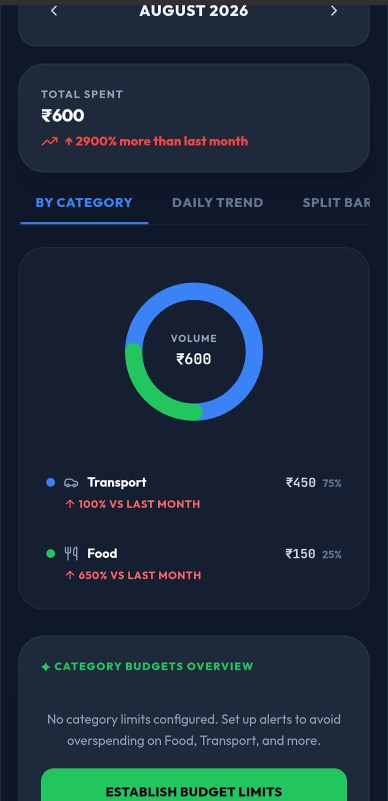
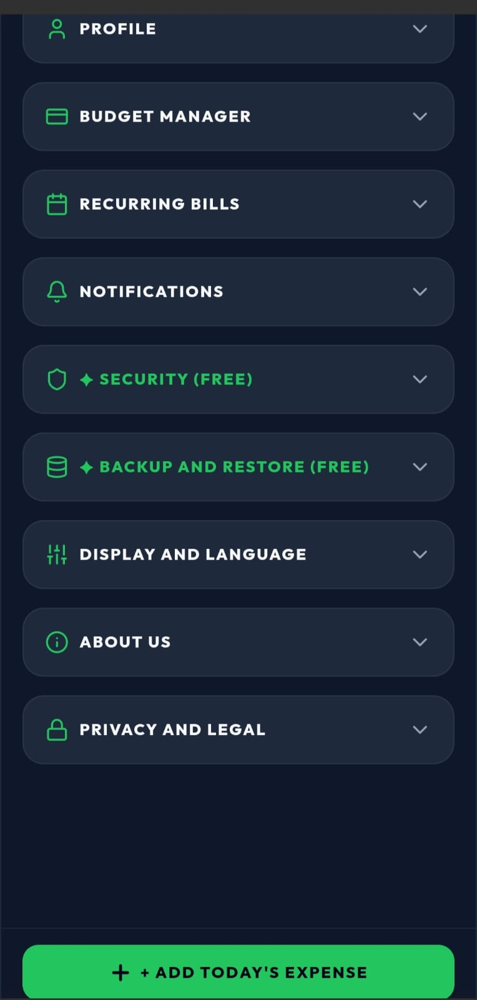

  <h1>💰 Spend Smart</h1>
  
A comprehensive, feature-rich Android expense tracker to manage budgets, analyze trends, and secure your financial data.

## 🚀 About the Project
Spend Smart is an intuitive personal finance application designed to give users total control over their money. Whether you need to track daily spending, convert currencies on the go, or analyze complex monthly trends, Spend Smart provides all the tools you need in a sleek, secure interface.

## 📸 App Interface

  
  
  
  

## ✨ Key Features

**📊 Expense & Budget Management**
* **Budget Manager:** Set and monitor custom limits to avoid overspending.
* **Savings Tracker:** Keep an eye on your financial goals.
* **Recurring Bills:** Automate tracking for your monthly subscriptions and fixed costs.
* **Custom Categories:** Personalize how you tag and organize your expenses.

**📈 Deep Analytics & Insights**
* **Monthly & Weekly Reports:** View every monthly expense at a glance.
* **Visual Data:** Understand your spending via Category breakdowns, Split Bars, Corridor views, and period-over-period Comparisons.
* **Trend Tracking:** Monitor your daily and monthly spending trends to see exactly where your money goes.

**🔒 Security & Utilities**
* **Passcode Lock:** Keep your financial data completely private and secure.
* **Currency Converter:** Easily convert money while traveling or managing international expenses.
* **Backup & Restore:** Never lose your data with built-in, free backup tools.
* **Modern UI:** Clean, dark-mode focused design for comfortable viewing.